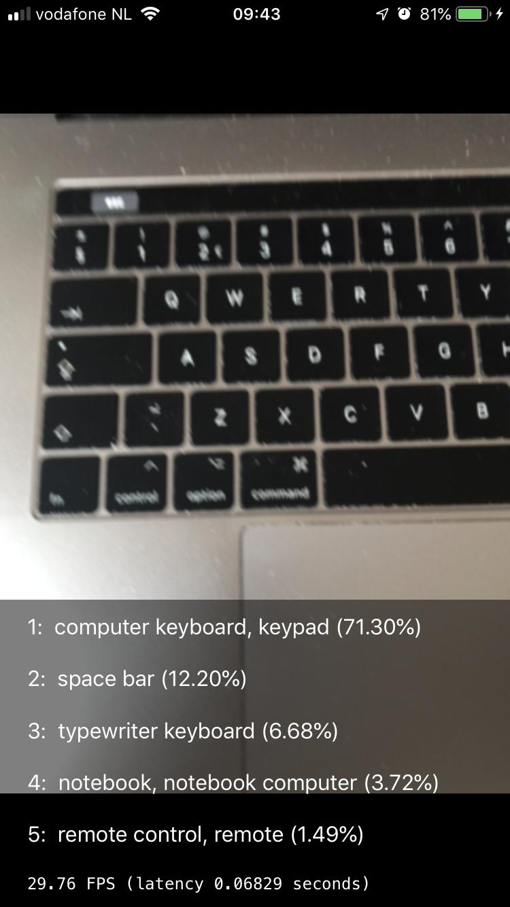

# ARScanner

## iOS 11 Project using Vision and CoreML to recognize objects from the camera's video output

### currently

- make `VNCoreMLRequest` every new videoframe (`AVCaptureVideoDataOutputSampleBufferDelegate`)
- use `VNSequenceRequestHandler`
- using `MobileNet.mlmodel` (https://arxiv.org/abs/1704.04861v1) for object classification

### todo

- figure out the best way to recognize multiple objects ( a better model like https://pjreddie.com/darknet/yolo/ , or process frame as a grid of small images )
- bounding boxes
- object tracking
